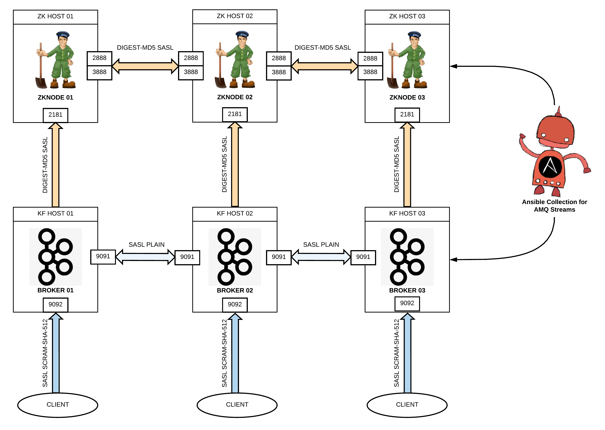
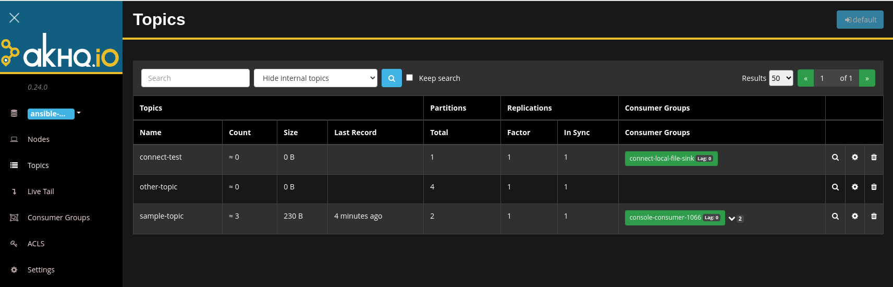

# Red Hat AMQ Streams Ansible Collection Demo

This repo includes a demo of [AMQ Streams Ansible Collection](https://github.com/ansible-middleware/amq_streams)
to deploy a Kafka cluster on three hosts:



## Prerequisites

The `redhat.amq_streams` role supports downloading and installing from the Red Hat Customer Portal using
credentials associated to a service account. After login in the customer portal and navigating to the
hybrid cloud console, select the
[services account tab](https://console.redhat.com/application-services/service-accounts)
to create one, if needed. Client ID and Client secret associated to the service account needs to
be provided with the following variables in the `service_account.yml` file:

```yaml
---
rhn_username: '<client_id>'
rhn_password: '<client_secret>'
omit_rhn_output: False
```

The downloaded product archive will be stored in the controller working directory, and then distributed
to target nodes.

If you want to use the collection available in Red Hat Automation Hub, then you must to have a valid
token in the `ansible.cfg` file. Your own token is available [here](https://console.redhat.com/ansible/automation-hub/token).

```
[galaxy]
server_list = automation_hub, galaxy

[galaxy_server.galaxy]
url = https://galaxy.ansible.com/

[galaxy_server.automation_hub]
url = https://cloud.redhat.com/api/automation-hub/
auth_url = https://sso.redhat.com/auth/realms/redhat-external/protocol/openid-connect/token
token = ADD_HERE_YOUR_TOKEN
```

## Inventory

The [`inventories/demo`](./inventories/demo) includes an example for three hosts to deploy this topology. Please, update it
to use the full qualified name for your own hosts or create your own inventory file with the valid references.

## Install Red Hat AMQ Streams Ansible Collection

Attached to this repo there is a tarball of the `redhat.amq_streams` collection that you can install:

```shell
ansible-galaxy collection install redhat.amq_streams
```

# Deploy Red Hat AMQ Streams

Run the command:

```shell
ansible-playbook -i inventories/demo playbooks/my-amq_streams_distributed_auth.yml -e @service_account.yml
```

# Create topics

Run the command:

```shell
ansible-playbook -i inventories/demo playbooks/my-amq_streams_topic.yml -e @service_account.yml
```

# Testing Red Hat AMQ Streams

You can create on one of the hosts the following command to authenticate the connections to
the brokers:

```shell
cat <<EOF > /tmp/kafka-cli.properties
security.protocol=SASL_PLAINTEXT
sasl.mechanism=PLAIN
sasl.jaas.config=org.apache.kafka.common.security.plain.PlainLoginModule required username="admin" password="p@ssw0rd";
EOF
```

This Kafka command will list the current topics created in the kafka cluster:

```shell
/opt/kafka_2.13-3.5.0.redhat-00014/bin/kafka-topics.sh --bootstrap-server localhost:9092 --command-config /tmp/kafka-cli.properties --list
```

This Kafka command will consume messages from one of the topics created by the collection:

```shell
/opt/kafka_2.13-3.5.0.redhat-00014/bin/kafka-console-consumer.sh --bootstrap-server localhost:9092 --topic sample-topic \
    --consumer.config /tmp/kafka-cli.properties \
    --from-beginning
```

This Kafka command will produce messages into one of the topics created by the collection:

```shell
/opt/kafka_2.13-3.5.0.redhat-00014/bin/kafka-console-producer.sh --broker-list localhost:9092 --topic sample-topic \
    --producer.config /tmp/kafka-cli.properties
```

# AKHQ - Manage and view your Kafka cluster

[akhq](https://akhq.io/) is a Kafka GUI to manage topics, data, consumers groups and more things
of a Kafka cluster. You can use it to connect to the Kafka cluster created.

Running the following command from the [akhq](./akhq/) folder you can access it:

```shell
cd akhq
./monitor.sh
```

The Kafka GUI is available at [http://localhost:8888/](http://localhost:8888/).



The [application.yml](./akhq/application.yml) file has all the configuration required to access to
the Kafka cluster deployed. Please, review the `bootstrap.servers` property to use the hosts defined in your
own inventory.
